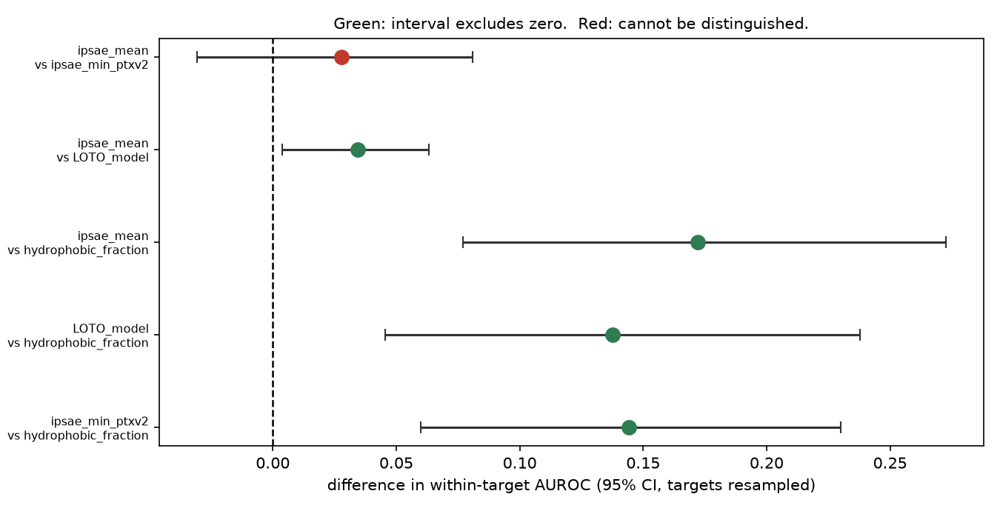
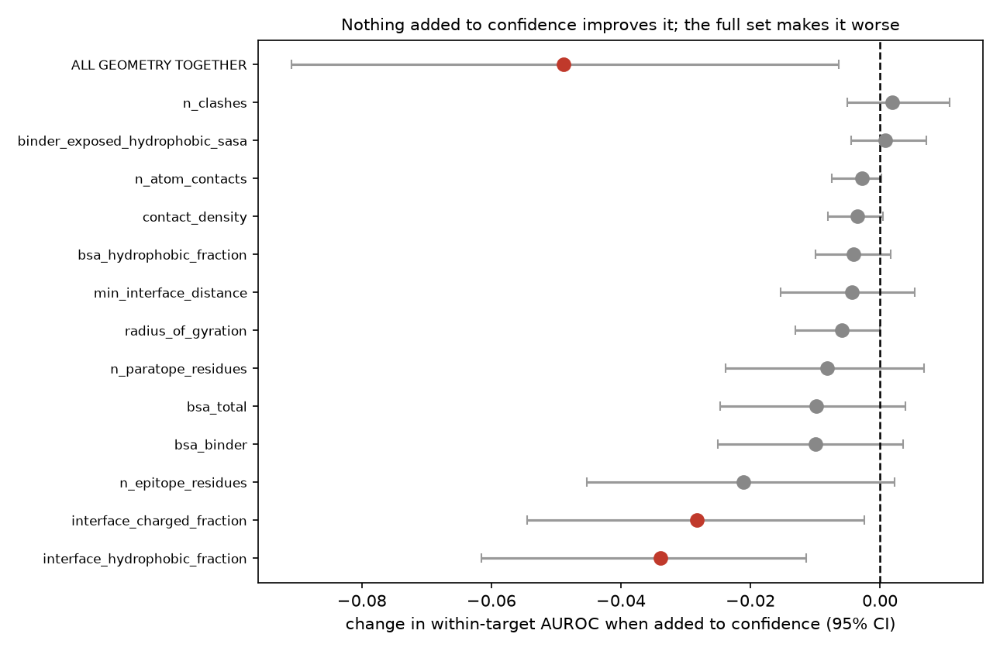

# binderkit

A de novo protein binder design pipeline for the Anthropic x Adaptyv 2026
competition, and a retrospective study of whether the in-silico metrics
everyone ranks designs on actually predict experimental binding.

**The study is the part worth reading.** The pipeline currently runs at Tier C,
which means it cannot generate a real design on this hardware.

---

## Headline results

Two studies on **1,320 published de novo binders against 15 targets** whose
wet-lab outcomes are open. Neither needed a GPU.

### Study 1 — do the scores predict binding?

| | Within-target AUROC |
|---|---|
| `ipsae_mean` (co-folding confidence, mean of 10 predictors) | **0.761** |
| best individual predictor | 0.733 |
| leave-one-target-out model over 27 score columns | 0.726 |
| best trivial baseline (`hydrophobic_fraction`) | 0.589 |

**What survives every correction:** confidence beats the trivial baseline by
**+0.172, 95% CI +0.077 to +0.273**, sign held in all 2,000 replicates.

**What does not:** averaging ten predictors is *not* measurably better than
using one (+0.028, CI −0.031 to +0.081). **One predictor is enough**, which is
roughly a tenfold saving in co-folding cost. Training a model over all the
scores is worse than their plain average (−0.034, CI −0.063 to −0.004).



Also: the reliability curve **inverts** above 0.6 — designs predicted at 70–80%
bound only 28% of the time, worse than mid-range predictions.

### Study 2 — does interface geometry add anything?

**No.** None of thirteen geometry metrics computed on real coordinates improves
a model that already has the confidence score, two measurably hurt, and all
thirteen together score **0.049 lower** (CI −0.091 to −0.006).



The expensive structural stage is redundant *for ranking*. The metric code is
validated rather than assumed correct: it reproduces the release's published
epitope, paratope and atom-contact counts **exactly on all 981 comparable
designs**.

Full numbers: [`studies/retrospective/REPORT.md`](studies/retrospective/REPORT.md)
and [`studies/interface_geometry/REPORT.md`](studies/interface_geometry/REPORT.md).
Conclusions withdrawn between sessions, and why:
[`studies/retrospective/CHANGES.md`](studies/retrospective/CHANGES.md).

A plain-language version for non-specialists is in
[`docs/WRITEUP.md`](docs/WRITEUP.md).

## Honest status

- **Most de novo designs fail.** Across the campaign studied here the measured
  binder rate was **26.8%** (354 of 1,320). On **EGFR specifically — this
  challenge's target — it was 11.1%** (10 of 90), one of the hardest targets in
  the set, with far more compute than this repo has.
- **Per-target performance is too uncertain to filter on.** EGFR is 0.669 but
  its 95% CI is 0.466–0.857, which includes chance; 4 of 14 targets do. Session 1
  stated the EGFR and BBF-14 numbers as facts and both were withdrawn. Confidence
  is wired in as a soft ranking signal, never a hard filter.
- Two wet-lab assays on the same designs agree only **89%** of the time, which
  is a ceiling on what any in-silico metric can be asked to achieve.
- **Track 3 has no guaranteed testing slot.** Tracks 2 and 3 share one 384-well
  plate per problem, selected by a workflow the organisers have not published.
- **This repo cannot currently produce a submittable design.** At Tier C, the
  backbone, sequence and folding stages are mocked. See
  [`docs/LIMITATIONS.md`](docs/LIMITATIONS.md), which is a complete list, not a
  summary.

## Install

```bash
python -m venv .venv
.venv/Scripts/python -m pip install -e ".[dev]"     # Windows
# source .venv/bin/activate && pip install -e ".[dev]"   # POSIX
```

Python >= 3.10. No GPU required for anything in this repo as it stands.

## Run

```bash
binderkit compute --write                    # probe hardware, write docs/COMPUTE.md, set tier
binderkit run --challenge 01-egfr            # full pipeline, writes challenges/01-egfr/submission/
binderkit validate challenges/01-egfr/submission/submission.csv
binderkit study retrospective                # study 1: do the scores work?
binderkit study geometry                     # study 2: does geometry add anything?
```

Add `--tier B` to override tier detection, or `--resume` to reuse completed
stages. Every stage writes `work/<run_id>/<stage>.parquet` and is skipped if its
output exists, unless `--force`.

```bash
pytest -q -m "not slow"      # 96 tests, offline, no GPU, ~4s
ruff check . && ruff format --check .
```

## How it works

```
target.py     fetch 6ARU + P00533, clean the chain, build the PDB->UniProt
              numbering map, pick the epitope, rank hotspots
stages.py     generate backbones -> design sequences -> co-fold (all behind
              one interface each; GPU backends raise rather than silently mock)
metrics.py    interface confidence, monomer quality, self-consistency,
              interface geometry, developability liabilities, seed agreement
novelty.py    the gate every design must pass: sequence identity, known-binder
              screen, within-batch clustering
objectives/   per-challenge conditional properties, each returning a value,
              an uncertainty and a plain-English reason
rank.py       hard filters, then the challenge's stated objective priority
              order, then diversity-aware selection
package.py    submission.csv, METHODS.md, metrics.csv, ranking_full.csv,
              novelty.csv, provenance.json
validate.py   format checks plus a scan for text that reads as an instruction
              to a model, which is a hard failure
```

### Two things it gets right that are easy to get wrong

**Residue numbering.** PDB 6ARU numbers the *mature* EGFR protein; UniProt
P00533 numbers the precursor including its 24-residue signal peptide. The
offset is a constant **+24**, recovered by alignment with 607/609 residue
identities agreeing. Assuming an offset of zero would place the Domain III
epitope about two helical turns away from where it is, and every hotspot would
be wrong while looking entirely plausible. There is a test for this.

**Grouped splits.** Measured binder rates in the study data run from 0% (MBP)
to 80% (TREM2). A design-level train/test split lets a model infer which target
a design belongs to and read off that target's base rate. Every fold and every
bootstrap replicate resamples **whole targets**, and there is a test asserting
no target appears in both train and test.

## Competition context

Challenge 1 targets EGFR (UniProt P00533-1, PDB 6ARU chain A, Domain III
epitope), with objectives in this stated order:

1. pH-selective binding — bind at pH 6.5, not at pH 7.4
2. Mouse cross-reactivity — bind human and mouse EGFR equally
3. Binding affinity against human EGFR

Note that affinity is ranked **last**. Domain III is 90.6% conserved between
human and mouse EGFR (computed, see `binderkit run`), so objective 2 is
achievable at this epitope.

Rules, deadlines and sources: [`docs/BACKGROUND.md`](docs/BACKGROUND.md).

**This repo never submits anything.** Submission requires a human to review the
designs, and the competition terms make publication a decision with patent
consequences.

## Documentation

| File | What it holds |
|---|---|
| [`studies/retrospective/REPORT.md`](studies/retrospective/REPORT.md) | the study: numbers, figures, per-target breakdown, calibration |
| [`docs/LIMITATIONS.md`](docs/LIMITATIONS.md) | every mock, skip, proxy and guessed threshold |
| [`docs/BACKGROUND.md`](docs/BACKGROUND.md) | competition rules and prior art, with sources and access dates |
| [`docs/TOOLS.md`](docs/TOOLS.md) | versions, licences, VRAM, what ran and what did not |
| [`docs/COMPUTE.md`](docs/COMPUTE.md) | hardware and how the tier was chosen |
| [`docs/WRITEUP.md`](docs/WRITEUP.md) | plain-language write-up for a general reader |
| [`docs/CLUSTER_REQUEST.md`](docs/CLUSTER_REQUEST.md) | the compute ask, with measured benchmarks |
| [`studies/retrospective/CHANGES.md`](studies/retrospective/CHANGES.md) | conclusions withdrawn in session 2, and why |
| [`docs/LESSONS.md`](docs/LESSONS.md) | what each session learned |

## Licence

MIT for this code. Data sources carry their own licences; see
[`docs/TOOLS.md`](docs/TOOLS.md). The Anthropic binder release is CC BY 4.0 and
is cited accordingly.
