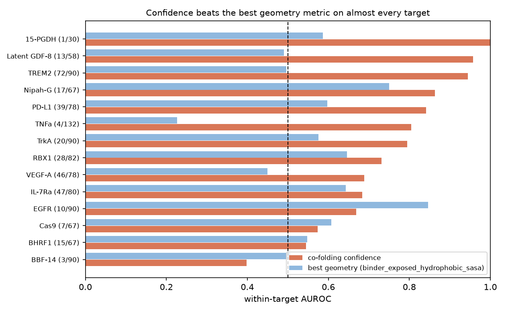

# Does interface geometry add anything over co-folding confidence?

**Not additively, for the thirteen metrics tested - and adding all thirteen
makes prediction measurably worse.** The multiplicative form the
literature reports does help was tested separately in study 3, for shape
complementarity, and did not help here either; the interface-energy
feature could not be computed. See "Where this conflicts with the
literature" below.

Generated by `binderkit study geometry`. Every number is reproducible from
that command.

## The question

Study 1 found that co-folding confidence predicts measured binding at 0.761
within-target AUROC. Structure-based design pipelines also compute interface
geometry - buried surface area, contact counts, hydrogen bonds, interface
composition - and rank on it. The question is whether that adds anything
once you already have the confidence number.

This has been asked before on other corpora. Overath et al. 2025
(bioRxiv 2025.08.14.670059) meta-analysed 3,766 experimentally
characterised binders and report that confidence **multiplied by** interface
dG/dSASA beats either alone. What is new here is not the question but the
dataset: no prior analysis of this release exists, and it is the only corpus
with one campaign, one adjudication rubric and two independent assays.
The conflict with their result is addressed below, and it may not be a real
disagreement.

The question here is deliberately **conditional**. Several geometry metrics
do correlate with binding on their own. That is not the useful question. The
useful question is whether a model that already knows the confidence score
gets better when geometry is added to it.

## Data

1189 designs across 15 targets with both a released design
model and a wet-lab outcome; binder rate 27.1%. No
structure prediction was run: the coordinates are the release's own design
models.

### The implementation is validated, not assumed correct

The release publishes its own epitope contact counts computed on these same
files, so the geometry code is checked against a published number on
981 designs:

| Quantity | Exact matches | Correlation |
|---|---|---|
| epitope residues | 981/981 (100.0%) | 1.0000 |
| paratope residues | 981/981 (100.0%) | 1.0000 |
| interface atom contacts | 981/981 (100.0%) | 1.0000 |

Agreement is exact on every comparable design. That matters beyond tidiness:
it means this metric code can be pointed at designs generated later without
first having to debug the scoring, which is the expensive way to discover a
contact definition was wrong.

Getting there required fixing a real bug. Several targets are not protein
only - Cas9 is modelled as a ribonucleoprotein with an sgRNA chain, RBX1
carries three zinc ions, 15-PGDH an NAD cofactor. Counting binder-to-RNA and
binder-to-ligand atom pairs as interface contacts inflated some Cas9 designs
by a factor of eighty. Restricting the target to protein chains took
agreement from 95.5% to 100%.

### What the models can and cannot show

| design_model_status | n | binder rate |
|---|---|---|
| `ordered_sequence_backbone` | 912 | 30.0% |
| `ordered_sequence_all_atom` | 193 | 16.6% |
| `ordered_sequence_threaded_on_design_backbone` | 65 | 23.1% |
| `ordered_sequence_ca_trace` | 11 | 0.0% |
| `ordered_sequence_threaded_ca_trace` | 8 | 12.5% |

Only **193 of 1189** design models carry side
chains on the binder; the rest are backbone plus C-beta. Hydrogen bonds and
salt bridges involving a binder side chain are therefore *unobservable* in
most of this data, not zero, and are reported as missing. They are analysed
separately below on the subset where they exist.

Note also that model status is confounded with outcome: the all-atom subset
has a very different binder rate from the backbone-only majority, so the two
cannot be pooled and the subset result does not generalise.

## Each geometry metric on its own

Within-target AUROC. Values below 0.5 are informative with the sign flipped.

| Metric | Within-target AUROC | Direction |
|---|---|---|
| `binder_exposed_hydrophobic_sasa` | 0.569 | higher is better |
| `interface_hydrophobic_fraction` | 0.558 | higher is better |
| `interface_charged_fraction` | 0.442 | **lower** is better |
| `bsa_binder` | 0.536 | higher is better |
| `n_atom_contacts` | 0.530 | higher is better |
| `n_paratope_residues` | 0.528 | higher is better |
| `bsa_total` | 0.523 | higher is better |
| `bsa_hydrophobic_fraction` | 0.523 | higher is better |
| `contact_density` | 0.521 | higher is better |
| `n_epitope_residues` | 0.516 | higher is better |
| `radius_of_gyration` | 0.508 | higher is better |
| `n_clashes` | 0.495 | **lower** is better |
| `min_interface_distance` | 0.500 | higher is better |
| **`ipsae_mean` (reference)** | **0.750** | higher is better |

The strongest geometry metric is `binder_exposed_hydrophobic_sasa` at 0.569, against
0.750 for the confidence score. Nothing in the geometry
comes close to it.

### Size-like metrics, compared within target

A previous version of this report compared interface size between binders
and non-binders **pooled across targets**, and concluded that binders had
fewer contacts and less buried surface. That was Simpson's paradox: the
targets with the largest interfaces (TNFa, MBP) are the ones nobody could
bind, so pooling measures target difficulty, not design quality. Computed
inside each target on the same file, every one of these differences
reverses sign. The claim is withdrawn; see `CHANGEstats.md`.

| Metric | pooled difference | within-target difference | targets positive |
|---|---|---|---|
| `n_atom_contacts` | -51.13 | **+31.18** | 9/14 |
| `bsa_binder` | -70.04 | **+49.28** | 10/14 |
| `bsa_total` | -136.61 | **+72.84** | 9/14 |
| `contact_density` | -0.55 | **+0.49** | 8/14 |

Within a target, binders have **more** contacts and **more** buried surface,
which is both the unsurprising direction and what the within-target AUROC
column above said all along. The effect is small - these metrics sit at
0.52-0.54 AUROC - and the conditional test below is what decides whether it
is worth anything.

## The conditional test: does it add to confidence?

Each row is a leave-one-target-out model given the confidence score plus one
geometry metric, compared against the same model given confidence alone.
Paired bootstrap, 1500 replicates resampling targets.

| Added metric | With | Without | Difference | 95% CI | Verdict |
|---|---|---|---|---|---|
| `n_clashes` | 0.751 | 0.750 | +0.002 | -0.005 to +0.011 | no effect |
| `binder_exposed_hydrophobic_sasa` | 0.750 | 0.750 | +0.001 | -0.004 to +0.007 | no effect |
| `n_atom_contacts` | 0.747 | 0.750 | -0.003 | -0.007 to +0.000 | no effect |
| `contact_density` | 0.746 | 0.750 | -0.003 | -0.008 to +0.001 | no effect |
| `bsa_hydrophobic_fraction` | 0.746 | 0.750 | -0.004 | -0.010 to +0.002 | no effect |
| `min_interface_distance` | 0.745 | 0.750 | -0.004 | -0.015 to +0.005 | no effect |
| `radius_of_gyration` | 0.744 | 0.750 | -0.006 | -0.013 to +0.000 | no effect |
| `n_paratope_residues` | 0.741 | 0.750 | -0.008 | -0.024 to +0.007 | no effect |
| `bsa_total` | 0.740 | 0.750 | -0.010 | -0.025 to +0.004 | no effect |
| `bsa_binder` | 0.740 | 0.750 | -0.010 | -0.025 to +0.004 | no effect |
| `n_epitope_residues` | 0.729 | 0.750 | -0.021 | -0.045 to +0.002 | no effect |
| `interface_charged_fraction` | 0.721 | 0.750 | -0.028 | -0.054 to -0.002 | **hurts** |
| `interface_hydrophobic_fraction` | 0.716 | 0.750 | -0.034 | -0.062 to -0.011 | **hurts** |

**Not one of the 13 geometry metrics improves prediction
over confidence alone.** 2 measurably hurt (`interface_hydrophobic_fraction`, `interface_charged_fraction`), and 0 help.

### All of it together

A model given confidence plus all 13 geometry metrics scores
**0.701** against **0.750** for confidence alone:
-0.049, 95% CI -0.091 to -0.006, sign held
in 99% of replicates.

Adding the full structural analysis makes held-out prediction **measurably
worse**. The extra features add variance that does not transfer across
targets, which is the same pattern study 1 found when it fitted weights
over ten predictors.

## Hydrogen bonds and salt bridges, where they can be seen

These exist only for the 193 designs with binder side chains, whose
binder rate is 16.6% against 27.1%
for the full set. The subset is small and not representative, so this is a
weaker test than the one above.

On that subset the confidence score itself only reaches
0.575, which is well below its 0.750
on the full data - another sign the subset is a harder and different
sample. Alone, hydrogen bonds score 0.588 and salt bridges 0.538.

Added to confidence: -0.074, 95% CI -0.139 to -0.019.

So there is no evidence that they add anything either, but with 193 designs this test is underpowered and should not be read as a
strong negative.

## Per-target

Best geometry metric (`binder_exposed_hydrophobic_sasa`) against the confidence score, by target.

| Target | n | binders | geometry AUROC | 95% CI | confidence AUROC |
|---|---|---|---|---|---|
| EGFR | 90 | 10 | 0.846 | 0.727-0.940 | 0.669 |
| Nipah-G | 67 | 17 | 0.751 | 0.618-0.869 | 0.864 |
| RBX1 | 82 | 28 | 0.646 | 0.506-0.780 | 0.731 |
| IL-7Ra | 80 | 47 | 0.643 | 0.513-0.765 | 0.684 |
| Cas9 | 67 | 7 | 0.607 | 0.307-0.886 | 0.574 |
| PD-L1 | 78 | 39 | 0.597 | 0.470-0.723 | 0.841 |
| 15-PGDH | 30 | 1 | 0.586 | 0.400-0.759 | 1.000 |
| TrkA | 90 | 20 | 0.576 | 0.450-0.707 | 0.794 |
| BHRF1 | 67 | 15 | 0.548 | 0.322-0.750 | 0.545 |
| BBF-14 | 90 | 3 | 0.506 | 0.315-0.670 | 0.398 |
| TREM2 | 90 | 72 | 0.496 | 0.342-0.648 | 0.944 |
| Latent GDF-8 | 58 | 13 | 0.491 | 0.317-0.675 | 0.957 |
| VEGF-A | 78 | 46 | 0.450 | 0.321-0.577 | 0.688 |
| TNFa | 132 | 4 | 0.227 | 0.073-0.365 | 0.805 |

On EGFR specifically, geometry reaches 0.846 (CI 0.727-0.940) against 0.669 for confidence, on 10 binders
in 90 designs. Like every per-target number in these studies, the interval
is too wide to support a claim on its own.

## Where this conflicts with the literature

Overath et al. 2025 report the opposite for two features this study did not
compute: `ipSAE_min x interface_dG/dSASA` and `LIS x shape_complementarity`
each beat either component alone, on 3,766 binders across 15 targets.

Two reasons that may not contradict the result above, and both are limits of
this study rather than of theirs:

1. **Different features.** Interface dG/dSASA and Lawrence-Colman shape
   complementarity are not among the thirteen tested here. The two features
   the literature says work are precisely the two that were not measured.
2. **Different functional form, and this is the one that matters.** Their
   combination is a *product*. The test above adds geometry as an additional
   *linear term* to a model that already has confidence. A logistic model in
   (confidence, geometry) cannot represent confidence x geometry unless the
   interaction is handed to it explicitly. A null additive effect is fully
   compatible with a real multiplicative one, so this study has not tested
   their claim.

**That experiment has now been run, for one of the two features.** Study 3
(`binderkit study replication`, `studies/replication/REPORT.md`) computes
shape complementarity licence-free and tests the product their way, by
average precision under leave-one-target-out, and our way, by within-target
AUROC. On 1,153 designs the product is **worse** than confidence alone by
both measures (AP -0.061, CI -0.108 to -0.017; AUROC -0.048, CI -0.091 to
-0.008), and a logistic model handed the interaction term explicitly does
not improve either (-0.002, CI -0.019 to +0.014). The objection that this
study could not have represented a product is therefore answered by direct
test rather than by argument.

**Their other feature was not tested.** `interface_dG/dSASA` needs
PyRosetta, which requires licence credentials this environment does not
have, and section 8.6 forbids substituting another energy function and
calling it a replication. Their strongest reported combination therefore
remains untested here, their corpus is three times larger, and study 3
reports its outcome as *not reproduced on this dataset* rather than as a
correction to their work. The finding below should still be read in its
narrow form.

## What this means

1. **No *additive* effect was found for thirteen geometry metrics.** If you
   have co-folding confidence, adding any of these thirteen as an extra
   linear feature does not improve held-out ranking, and adding all thirteen
   makes it measurably worse. This is not the same as 'geometry is
   redundant': a multiplicative interaction with interface energetics was
   not tested here and is reported to work elsewhere.
2. **That is a compute saving, not a disappointment.** It removes a stage from
   any pipeline built to scale, and it says where the hours should go instead:
   into generating and folding more designs, not into scoring each one more
   elaborately.
3. **Geometry still has non-ranking uses.** Clash counts and buried surface
   area remain the right tools for diagnosing *why* a design looks wrong, and
   for reporting what was made. This result is about ranking, not about
   whether the numbers are meaningful.
4. **The metric code is now validated against published values**, so it can be
   pointed at new designs without re-litigating whether it is correct.

## What this study cannot tell you

- **Whether geometry computed on a *predicted* complex behaves differently.**
  These are design models - the pose the designer intended - not co-folds.
  A co-fold's geometry is a different measurement and could carry different
  information. That is the obvious next test and it needs no new wet-lab data.
- **Anything about side-chain chemistry at scale.** Most binder chains here
  have no side chains, so hydrogen bonds and salt bridges could only be tested
  on a small, unrepresentative subset.
- **Whether a better geometry metric exists.** Thirteen were tested; shape
  complementarity in the classical sense, interface packing density and
  Rosetta interface energy were not among them.
- **Whether confidence multiplied by *interface energy* behaves
  differently.** The multiplicative form was tested for shape
  complementarity in study 3 and did not help; the energy feature could
  not be computed at all.
- The same selection bias that qualifies study 1 applies here: these designs
  were chosen for ordering using the confidence metric, so the sample is
  filtered on the very reference this study compares against.
