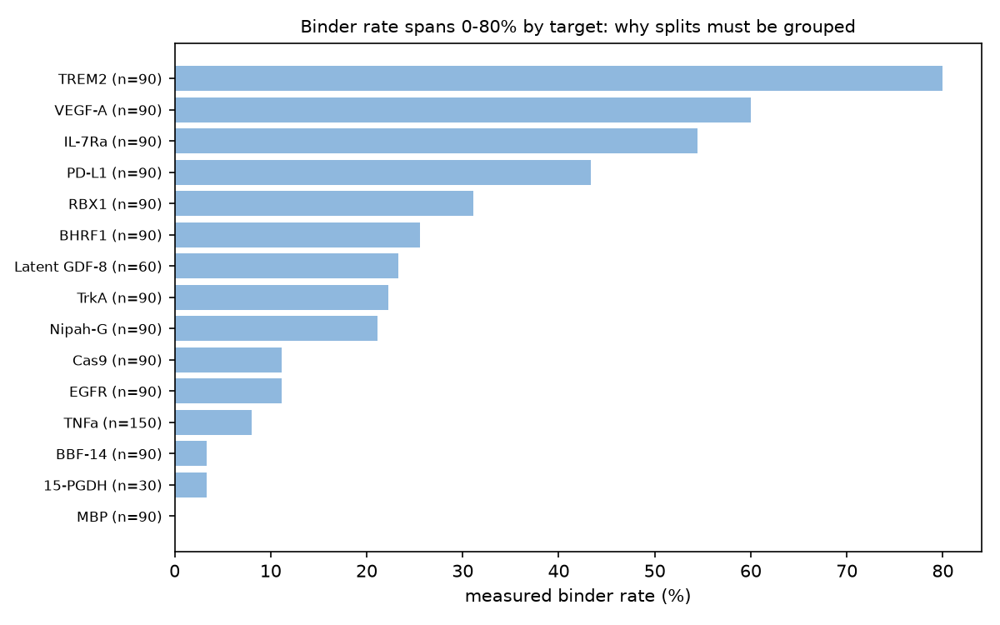
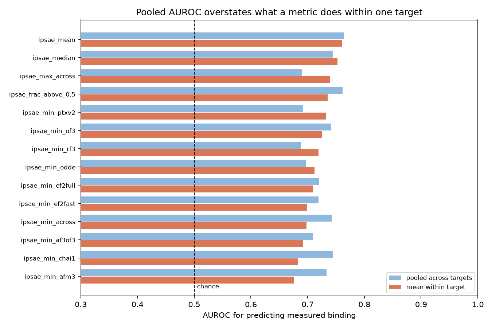
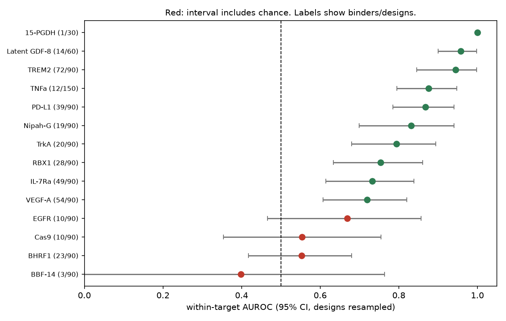
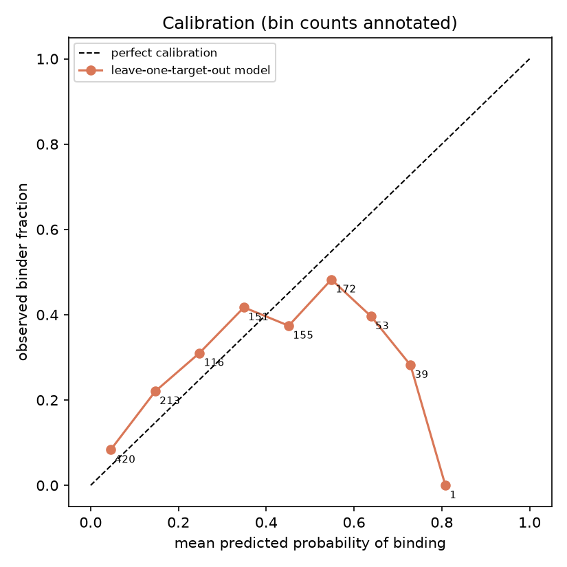

# Do in-silico metrics predict experimental binding?

A retrospective calibration study on the published Anthropic de novo binder
campaign. Generated by `binderkit study retrospective`; every number is
reproducible from that script.

> **Revised in session 2.** Session 1 reported the right quantities but
> stated two conclusions more confidently than its own uncertainty allowed.
> Differences now carry paired confidence intervals and the metric screen is
> corrected for. [`CHANGEstats.md`](CHANGEstats.md) lists what changed and why.

## Bottom line

On 1320 designs against 15 targets (354 measured binders, 26.8%):

**What survives.** Co-folding confidence predicts measured binding far better
than a trivial baseline. `ipsae_mean` reaches 0.761 within-target AUROC against 0.589 for `hydrophobic_fraction`, a difference of **+0.172** (95% CI +0.077 to +0.273, sign held in 100% of replicates). This is the robust
result of the study and it is not close to the boundary.

**What does not survive.** Session 1 concluded that averaging ten predictors
beats the best individual predictor. With a paired interval that comparison is
+0.028, 95% CI -0.031 to +0.081 — it straddles zero, so the two **cannot be distinguished at this sample
size**. The practical consequence is in the other direction from session 1's:
a compute-constrained user can run **one** predictor (`ipsae_min_ptxv2`,
0.733) rather than ten, because the ten-predictor mean
is not measurably better.

**What survives in weakened form.** The learned model really is worse than the
plain average it was given: +0.034, 95% CI +0.004 to +0.063. The interval excludes zero but
only just, so this is a real effect of modest size, not a headline.

**And a caution about all of the above.** 30 metrics
were screened. Re-selecting the winner inside each bootstrap replicate, the
nominal winner `ipsae_mean` is the winner in only
**64%** of replicates and 8 different metrics win at least once. The
selection-corrected interval for "the best of 30" is
0.689 to 0.847.
*Which* metric is best is not resolved by this data; that a good confidence
metric beats a trivial baseline is.

## Data, and the selection bias that qualifies every number

Source: `huggingface.co/datasets/Anthropic/claude-protein-binder-design`,
`data/tables/design_summary.csv`, v1.0 (2026-08-18). **Licence CC BY 4.0.**
1320 designs retained of 1,440; the 120 mature GDF-8 designs have no
adjudicated outcome (their antigen aggregated) and are dropped.

### These designs are not a random sample

The release states plainly that ipSAE is "the primary confidence metric and
the one designs were selected on" (`docs/INSILICO.md`). So the 1,320 designs
with wet-lab outcomes were **chosen using the very metric this study
evaluates**. Three consequences, and they point in different directions:

1. **The measured AUROC is probably an underestimate.** The sample is range
   restricted: designs with low ipSAE were largely never ordered, so the easy
   discriminations are missing and the metric is being graded on the hard
   cases it itself selected. On an unscreened pool its discrimination would
   likely be higher.
2. **The operating point does not transfer.** The threshold and precision
   below are measured on an already-filtered pool. A pipeline that generates
   designs from scratch faces a very different score distribution, and would
   see a different precision at the same cut-off. The threshold is still the
   best available starting point; the precision attached to it is not a
   promise.
3. **It cannot be corrected for here**, because the designs that were
   generated and *not* ordered are not in the release. The generated-to-ordered
   ratio is not recoverable from the published tables.

## Why every split and every bootstrap is grouped by target

| Target | n | binder rate |
|---|---|---|
| TREM2 | 90 | 80.0% |
| VEGF-A | 90 | 60.0% |
| IL-7Ra | 90 | 54.4% |
| PD-L1 | 90 | 43.3% |
| RBX1 | 90 | 31.1% |
| BHRF1 | 90 | 25.6% |
| Latent GDF-8 | 60 | 23.3% |
| TrkA | 90 | 22.2% |
| Nipah-G | 90 | 21.1% |
| Cas9 | 90 | 11.1% |
| EGFR | 90 | 11.1% |
| TNFa | 150 | 8.0% |
| BBF-14 | 90 | 3.3% |
| 15-PGDH | 30 | 3.3% |
| MBP | 90 | 0.0% |

Binder rates run from 0% to 80% by target. A design-level split lets a model
infer the target and read off its base rate. Folds hold out whole targets and
bootstrap replicates resample whole targets; for paired comparisons both
metrics are scored on the *same* resample, which is what makes a difference of
a few hundredths resolvable at all.

## Paired comparisons

Within-target AUROC. 2000 bootstrap replicates, targets resampled with
replacement, both metrics scored on each identical resample.

| Comparison | A | B | Difference | 95% CI | Sign held | Verdict |
|---|---|---|---|---|---|---|
| consensus mean vs the best individual predictor | 0.761 | 0.733 | +0.028 | -0.031 to +0.081 | 84% | not distinguishable |
| consensus mean vs a learned model over all metrics | 0.761 | 0.726 | +0.034 | +0.004 to +0.063 | 99% | **distinguishable** |
| consensus mean vs the best trivial baseline | 0.761 | 0.589 | +0.172 | +0.077 to +0.273 | 100% | **distinguishable** |
| learned model vs the best trivial baseline | 0.726 | 0.589 | +0.138 | +0.046 to +0.238 | 100% | **distinguishable** |
| best individual predictor vs the best trivial baseline | 0.733 | 0.589 | +0.144 | +0.060 to +0.230 | 100% | **distinguishable** |

- `ipsae_mean` and `ipsae_min_ptxv2` **cannot be distinguished at this sample size**: difference +0.028, 95% CI -0.031 to +0.081, which straddles zero (sign held in only 84% of replicates).
- `ipsae_mean` is higher than `LOTO_model` by 0.034 (95% CI +0.004 to +0.063, sign held in 99% of replicates).
- `ipsae_mean` is higher than `hydrophobic_fraction` by 0.172 (95% CI +0.077 to +0.273, sign held in 100% of replicates).
- `LOTO_model` is higher than `hydrophobic_fraction` by 0.138 (95% CI +0.046 to +0.238, sign held in 100% of replicates).
- `ipsae_min_ptxv2` is higher than `hydrophobic_fraction` by 0.144 (95% CI +0.060 to +0.230, sign held in 100% of replicates).

## Per-target, with intervals

Within-target AUROC of `ipsae_mean`, bootstrapping **designs** inside
each target, which is the right unit once the target is fixed.

| Target | n | binders | AUROC | 95% CI | Note |
|---|---|---|---|---|---|
| 15-PGDH | 30 | 1 | 1.000 | 1.000-1.000 | only 1 binders - uninformative |
| Latent GDF-8 | 60 | 14 | 0.958 | 0.900-0.998 | - |
| TREM2 | 90 | 72 | 0.944 | 0.846-0.998 | - |
| TNFa | 150 | 12 | 0.876 | 0.795-0.947 | - |
| PD-L1 | 90 | 39 | 0.867 | 0.785-0.940 | - |
| Nipah-G | 90 | 19 | 0.831 | 0.699-0.940 | - |
| TrkA | 90 | 20 | 0.794 | 0.680-0.894 | - |
| RBX1 | 90 | 28 | 0.754 | 0.633-0.860 | - |
| IL-7Ra | 90 | 49 | 0.732 | 0.615-0.838 | - |
| VEGF-A | 90 | 54 | 0.719 | 0.608-0.820 | - |
| EGFR | 90 | 10 | 0.669 | 0.466-0.857 | CI includes chance |
| Cas9 | 90 | 10 | 0.554 | 0.354-0.755 | CI includes chance |
| BHRF1 | 90 | 23 | 0.553 | 0.418-0.680 | CI includes chance |
| BBF-14 | 90 | 3 | 0.398 | 0.000-0.764 | only 3 binders - uninformative |

**4 of 14 targets have a CI that includes
chance.** Session 1 reported two per-target claims that do not survive this:

- **EGFR** (this competition's target): 0.669, CI 0.466-0.857. With 10 binders in 90 designs the interval spans chance. Session 1 said the metric
  is "weaker on EGFR than on average"; the honest statement is that EGFR's
  value cannot be distinguished either from chance or from the overall mean.
- **BBF-14**: 0.398, CI 0.000-0.764, from
  3 binders. Session 1 called this "below chance". The
  interval covers almost the entire range; it supports no claim at all.
- Targets with fewer than 5 binders (15-PGDH, BBF-14) are reported but should not be
  read as evidence in either direction.

The *decision* that follows is unchanged, and is now better supported:
**confidence is a soft ranking signal, never a hard filter**, because
per-target behaviour is too uncertain to justify a fixed cut-off.

## Calibration: the curve inverts where it matters most

Expected calibration error is 0.078, which looks respectable and is
misleading on its own. The reliability curve is **not monotonic**: Spearman
correlation between predicted and observed across bins is +0.524 (p = 0.18).

| Predicted | n | Mean predicted | Observed | Observed 95% CI |
|---|---|---|---|---|
| 0.0-0.1 | 420 | 0.046 | 0.083 | 0.061-0.114 |
| 0.1-0.2 | 213 | 0.147 | 0.221 | 0.170-0.281 |
| 0.2-0.3 | 116 | 0.248 | 0.310 | 0.233-0.399 |
| 0.3-0.4 | 151 | 0.349 | 0.417 | 0.342-0.497 |
| 0.4-0.5 | 155 | 0.451 | 0.374 | 0.302-0.453 |
| 0.5-0.6 | 172 | 0.548 | 0.483 | 0.409-0.557 |
| 0.6-0.7 | 53 | 0.639 | 0.396 | 0.276-0.531 |
| 0.7-0.8 | 39 | 0.729 | 0.282 | 0.165-0.438 |
| 0.8-0.9 | 1 | 0.808 | 0.000 | **excluded, n too small** |

**The headline is the inversion, not the ECE.** Designs predicted at
0.73 bound at 28.2% (95% CI 16.5%-43.8%), *lower* than designs
predicted in the middle of the range. The model is least reliable exactly
where a confident prediction would be acted on, which is the opposite of
the property you want.

Observed binder rate in the top decile by score: **40.2%** (n = 132) against a base rate of 26.8%.

Session 1 plotted a bin containing a single design as a point estimate. Bins
with fewer than five designs are now excluded and named instead, and every
retained bin carries a Wilson interval.

## Retracted: cross-predictor disagreement as a signal

Session 1 reported that `ipsae_std_across` scores 0.370, below chance, and
concluded that predictor agreement is usable signal in its own right. Testing
that properly:

- Its correlation with `ipsae_mean` is -0.220, so it is partly, but
  not wholly, a restatement of the mean.
- Residualised on the mean it scores 0.399, so some marginal
  association does remain.
- **But the decisive test is whether it adds anything predictive.** A model
  given mean + disagreement scores 0.738 against
  0.761 for the mean alone: -0.023, 95% CI -0.042 to -0.008.

Adding disagreement makes out-of-target prediction **measurably worse**.
The session-1 conclusion is withdrawn: disagreement is not a usable
additional signal, and including it costs accuracy on unseen targets.

## Operating point, and what it is worth

On `ipsae_mean`, maximising the Youden J statistic: threshold
**0.635**, sensitivity 0.743, specificity
0.684, precision 0.463, selecting
568 of 1320 designs.

Precision 0.463 against a base rate of 0.268 is
about **1.7x enrichment**. Two caveats that
matter more than the number: most selected designs still do not bind, and per
the selection-bias section this precision was measured on a pool that had
already been filtered on this metric, so it will not transfer unchanged to an
unscreened pipeline.

## What this study cannot tell you

- **Whether the metric works on designs nobody would have ordered.** The
  sample is filtered on ipSAE, so the low-confidence region is largely absent.
- **Which metric is genuinely best.** The winner changes across bootstrap
  replicates (8 different winners); only the
  gap to a trivial baseline is resolved.
- **Whether any of this transfers to a different design pipeline.** These
  designs came from two large agentic campaigns with far more compute than this
  repo has, and the metric definitions here are the release's, not this
  repo's.
- **Anything about affinity.** The label is a binary adjudicated call. Many
  released K_D values are apparent rather than true.
- **Anything beyond 50-120 residue miniproteins against 16 targets.**

## Conclusions

1. **Co-folding confidence beats a trivial baseline by +0.172 within-target AUROC** (95% CI +0.077 to +0.273). This
   is the result that survives every correction applied here.
2. **One predictor is enough.** The ten-predictor mean cannot be distinguished
   from the single best predictor (+0.028, CI -0.031 to +0.081), which is a direct saving for
   anyone compute-constrained.
3. **Do not fit weights over the predictors.** A learned model scored below the
   plain average on held-out targets.
4. **Do not use any of these as a hard filter.** Per-target intervals are wide
   and 4 of 14 include chance.
5. **Do not trust high predicted probabilities.** The reliability curve inverts
   at the top of the range.
6. **The wet lab agrees with itself only 89% of the time**, which bounds every
   number above.

## Limitations

- 15 targets is few; intervals on target-level quantities are correspondingly
  wide, and the bootstrap cannot manufacture precision that the design of the
  study does not contain.
- Logistic regression with median imputation and no tuning. A stronger model
  might extract more, though the ceiling implied above is not far away.
- `binder_final` is a model-adjudicated label over two assays that disagree on
  11% of designs.
- The study inherits every caveat in the release's own `docs/DATA_NOTES.md`.
